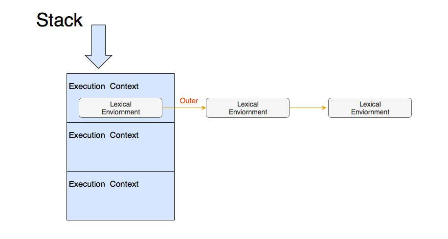

## 函数执行

### 闭包

闭包翻译自英文单词 closure，这是个不太好翻译的词，在计算机领域，它就有三个完全不相同的意义：编译原理中，它是处理语法产生式的一个步骤；计算几何中，它表示包裹平面点集的凸多边形（翻译作凸包）；而在编程语言领域，它表示一种函数。

闭包其实只是一个绑定了执行环境的函数，这个函数并不是印在书本里的一条简单的表达式，闭包与普通函数的区别是，它携带了执行的环境。

闭包包含两个部分
- 环境部分
	- 环境
	- 标识符列表
- 表达式部分

把这个放到javascript中

- 环境部分
  - 环境:函数的词法环境(执行上下文)
  - 标识符列表:函数中用到的未声明的变量
- 表达式部分:函数体

JavaScript 中的函数完全符合闭包的定义。它的环境部分是函数词法环境部分组成，它的标识符列表是函数中用到的未声明变量，它的表达式部分就是函数体。

### 执行上下文

在 JavaScript 的设计中，词法环境只是 JavaScript 执行上下文的一部分。

JavaScript 标准把一段代码（包括函数），执行所需的所有信息定义为：“执行上下文”。

#### 执行上下文在ES3中
- scope:作用域
- variable object:变量对象
- this value:this值
  
#### 在ES5中
- lexical environment:词法环境,当获取变量时使用
- variable environment:变量环境,当声明变量时使用
- this value:this值
  
#### 在ES2018中
- lexical environment:词法环境,当获取变量或者this值时使用
- variable environment:变量环境,当声明变量时使用
- code evaluation state:用于恢复代码执行位置
- Function:执行的任务是函数时使用,表示正在被执行的函数
- ScriptOrModule:执行的任务是脚本或者模块时使用,表示正在被执行的代码
- Realm:使用的基础库和内置对象实例
- Generator:仅生成器上下文有这个属性,表示当前生成器

以下语句会产生let使用的作用域
- for
- if
- switch
- try/catch/finally

### 函数

函数种类:
#### 普通函数
```js
function foo(){
    // code
}
```
#### 箭头函数
```js
const foo = () => {
    // code
}
```
#### 方法:在class中定义方法
```js
class C {
    foo(){
        //code
    }
}
```
#### 生成器函数
```js
function foo*(){
    // code
}
```

>生成器函数 (generator function)，它返回一个  Generator  对象。

#### 用class定义的类
```js
class Foo {
    constructor(){
        //code
    }
}
Foo instanceof Function  // true
```
#### 异步函数
```js
async function foo(){
    // code
}
const foo = async () => {
    // code
}
async function foo*(){
    // code
}
```

### this

```js
function showThis(){
    console.log(this);
}

var o = {
    showThis: showThis
}

showThis(); // global
o.showThis(); // o
```

普通函数的 this 值由“调用它所使用的引用”决定，其中奥秘就在于：我们获取函数的表达式，它实际上返回的并非函数本身，而是一个 Reference 类型（记得我们在类型一章讲过七种标准类型吗，正是其中之一）。

Reference 类型由两部分组成：一个对象和一个属性值。不难理解 o.showThis 产生的 Reference 类型，即由对象 o 和属性“showThis”构成。

当做一些算术运算（或者其他运算时），Reference 类型会被解引用，即获取真正的值（被引用的内容）来参与运算，而类似函数调用、delete 等操作，都需要用到 Reference 类型中的对象。

在这个例子中，Reference 类型中的对象被当作 this 值，传入了执行函数时的上下文当中。

至此，我们对 this 的解释已经非常清晰了：
<strong>调用函数时使用的引用，决定了函数执行时刻的 this 值。</strong>

如果，我们把这个例子稍作修改，换成箭头函数，结果就不一样了：
```js
const showThis = () => {
    console.log(this);
}

var o = {
    showThis: showThis
}

showThis(); // global
o.showThis(); // global
```
<strong>我们看到，改为箭头函数后，不论用什么引用来调用它，都不影响它的 this 值。</strong>

接下来我们看看“方法”，它的行为又不一样了：
```js
class C {
    showThis() {
        console.log(this);
    }
}
var o = new C();
var showThis = o.showThis;

showThis(); // undefined
o.showThis(); // global
```

按照我们上面的方法，不难验证出：生成器函数、异步生成器函数和异步普通函数跟普通函数行为是一致的，异步箭头函数与箭头函数行为是一致的。

#### this关键字的机制

函数能够引用定义时的变量，如上文分析，函数也能记住定义时的 this，因此，函数内部必定有一个机制来保存这些信息。

在 JavaScript 标准中，为函数规定了用来保存定义时上下文的私有属性 [[Environment]]。

当一个函数执行时，会创建一条新的执行环境记录，记录的外层词法环境（outer lexical environment）会被设置成函数的 [[Environment]]。

这个动作就是<strong>切换上下文</strong>了，我们假设有这样的代码：
```js
var a = 1;
foo();

在别处定义了 foo：

var b = 2;
function foo(){
    console.log(b); // 2
    console.log(a); // error
}
```
JavaScript 用一个栈来管理执行上下文，这个栈中的每一项又包含一个链表。如下图所示：

当函数调用时，会入栈一个新的执行上下文，函数调用结束时，执行上下文被出栈。

而 this 则是一个更为复杂的机制，JavaScript 标准定义了 [[thisMode]] 私有属性。

[[thisMode]] 私有属性有三个取值。

- lexical: 词法表示从上下文中找this,这对应了箭头函数
- global:全局表示当this为undefined时,取全局对象,对应了普通函数
- strict:当严格模式时使用,this严格按照调用时传入的值,可能为null或者undefined
  
非常有意思的是，方法的行为跟普通函数有差异，恰恰是因为 class 设计成了默认按 strict 模式执行。

```js
"use strict"
function showThis(){
    console.log(this);
}

showThis(); // undefined
// 如果不在严格模式,浏览器环境下this指向window
```
函数创建新的执行上下文中的词法环境记录时，会根据 [[thisMode]] 来标记新纪录的 [[ThisBindingStatus]] 私有属性。

代码执行遇到 this 时，会逐层检查当前词法环境记录中的 [[ThisBindingStatus]]，当找到有 this 的环境记录时获取 this 的值。

这样的规则的实际效果是，嵌套的箭头函数中的代码都指向外层 this，例如：
```js
var o = {}
o.foo = function foo(){
    console.log(this);
    return () => {
        console.log(this);
        return () => console.log(this);
    }
}

o.foo()()(); // o, o, o
```

