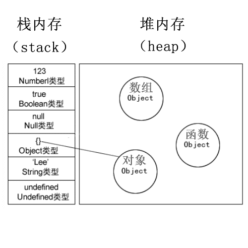
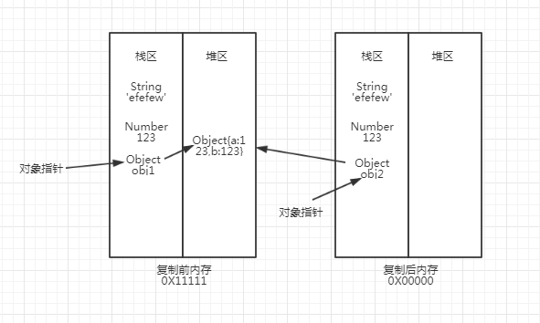

###### ARRON 2019 年 2 月 14 日

语言和宿主的基础设施由对象来提供，并且 JavaScript 程序即是一系列互相通讯的对象集合。

Object（对象）在英文中，是一切事物的总称，这和面向对象编程的抽象思维有互通之处。

对象并不是计算机领域凭空造出来的概念，它是顺着人类思维模式产生的一种抽象（于是面向对象编程也被认为是：更接近人类思维模式的一种编程范式）。

### JavaScript 对象的特征

不论我们使用什么样的编程语言，参考 Grandy Booch《面向对象分析与设计》总结来看，对象有如下几个特点。
- 对象具有唯一标识性：即使完全相同的两个对象，也并非同一个对象。
- 对象有状态：对象具有状态，同一对象可能处于不同状态之下。
- 对象具有行为：即对象的状态，可能因为它的行为产生变迁。

javascript的对象唯一标识性
```js
    var o1 = { a: 1 };
    var o2 = { a: 1 };
    console.log(o1 == o2); // false
```
关于对象的第二个和第三个特征“状态和行为”，不同语言会使用不同的术语来抽象描述它们。

在 JavaScript 中，将状态和行为统一抽象为“属性”。

```js
    var o = { 
        d: 1,
        f() {
            console.log(this.d);
        }    
    };
```
对象o有d和f两个属性。

<strong>在实现了对象基本特征的基础上, 我认为，JavaScript 中对象独有的特色是：对象具有高度的动态性，这是因为 JavaScript 赋予了使用者在运行时为对象添改状态和行为的能力。</strong>

为了提高抽象能力，JavaScript 的属性被设计成比别的语言更加复杂的形式，它提供了数据属性和访问器属性（getter/setter）两类。

### JavaScript 对象的两类属性

对 JavaScript 来说，属性并非只是简单的名称和值，JavaScript 用一组特征（attribute）来描述属性（property）。

先来说第一类属性，数据属性。数据属性具有四个特征。

- value：就是属性的值。
- writeable：决定属性能否被赋值。
- enumerble：决定 for in 能否枚举该属性。
- configurable：决定该属性能否被删除或者改变特征值。

第二类属性是访问器属性（getter/setter）属性,它也有四个属性。
- getter：函数或 undefined，在取属性值时被调用。
- getter：函数或 undefined，在设置属性值时被调用。
- enumerble：决定 for in 能否枚举该属性。
- configurable：决定该属性能否被删除或者改变特征值。

访问器属性使得属性在读和写时执行代码，它允许使用者在写和读属性时，得到完全不同的值。

```js
var o = {
  a: 7,
  get b() { 
    return this.a + 1;
  },
  set c(x) {
    this.a = x / 2
  }
};

console.log(o.a); // 7
console.log(o.b); // 8
o.c = 50;
console.log(o.a); // 25
```

我们通常用于定义属性的代码会产生数据属性，其中的 writable、enumerable、configurable 都默认为 true。我们可以使用内置函数 Object.getOwnPropertyDescripter 来查看，如以下代码所示：
```js
    var o = { a: 1 };
    o.b = 2;
    //a 和 b 皆为数据属性
    Object.getOwnPropertyDescriptor(o,"a") // {value: 1, writable: true, enumerable: true, configurable: true}
    Object.getOwnPropertyDescriptor(o,"b") // {value: 2, writable: true, enumerable: true, configurable: true}
```
如果我们要想改变属性的特征，或者定义访问器属性，我们可以使用 Object.defineProperty，示例如下：
```js
    var o = { a: 1 };
    Object.defineProperty(o, "b", {value: 2, writable: false, enumerable: false, configurable: true});
    //a 和 b 都是数据属性，但特征值变化了
    Object.getOwnPropertyDescriptor(o,"a"); // {value: 1, writable: true, enumerable: true, configurable: true}
    Object.getOwnPropertyDescriptor(o,"b"); // {value: 2, writable: false, enumerable: false, configurable: true}
    o.b = 3;
    console.log(o.b); // 2
```
其实Object.freeze(obj)就是改变obj的writable,configurable为false


实际上 JavaScript 对象的运行时是一个“属性的集合”，属性以字符串或者 Symbol 为 key，以数据属性特征值或者访问器属性特征值为 value。

### 对象类型的存储

在 JS 中，除了原始类型那么其他的都是对象类型了。对象类型和原始类型不同的是，原始类型存储的是值，对象类型存储的是地址（指针）。当你创建了一个对象类型的时候，计算机会在内存中帮我们开辟一个空间来存放值，但是我们需要找到这个空间，这个空间会拥有一个地址（指针）。



```js
const a = {}
let b = a
a.c = 666
console.log(b.c)  // 666
```
因为b和a指向同一个内存指针。同时也说明了const常量是针对内存指针的常量，只是内存指针地址不能改变。



### 函数传值

参数传值是指函数调用时，给函数传递配置或运行参数的行为，包括通过call、apply 进行传值。

基本类型和引用类型在变量复制的时候存在区别：

- 原始值：在将一个保存着原始值的变量复制给另一个变量时，会将原始值的副本赋值给新变量，此后这两个变量是完全独立的，他们只是拥有相同的 value 而已。
- 引用值：在将一个保存着对象内存地址的变量复制给另一个变量时，会把这个内存地址赋值给新变量，也就是说这两个变量都指向了堆内存中的同一个对象，他们中任何一个作出的改变都会反映在另一个身上。复制是不会产生新的堆内存消耗。

javascript 中所有函数参数都是按值传递，都是把形参复制给实参，只是基本数据类型复制的是原始值，而引用类型复制的是堆内存的地址。

#### 基本类型传值
```js
let a = 1
function foo(x) {
    x = 2
    console.log(x)
}
foo(a)  // 2
console.log(a)  // 1
```
它们在全局上下文和foo的上下文中各自保存了值1，且相互之间互不影响，我们对 a、x的读写操作，操作的是他们各自的值。

#### 引用类型传值

```js
let a = {
    abc: 1
}
function foo(x) {
    x.abc = 2
    console.log(x.abc)
}
foo(a)  // 2
console.log(a.abc)   // 2
```
上面的代码很容易得出一个错误的结论，对象传值是按引用传递的。

对象a的引用被传递到函数foo内部， 函数内部变量x指向全局变量a，从而实现了引用的传递，所以变量x和变量a读写的是同一个对象。

如果是按引用传递那下面这个例子就懵比了：
```js
let a = {
    abc: 1
}
function foo(x) {
    console.log(x) // {abc: 1}
    x = 2
    console.log(x) // 2
}
foo(a)
console.log(a.abc) // 1
```
为什么会出现a、x在指向同一个对象后，对x赋值又没有改变原对象的值呢？

因为这里对象传递给实参是按共享传递（call by sharing）的，根据引用类型变量复制的特点（上面描述过）：

foo 函数执行时， 形参 x 的值是传进去的对象 a 的内存地址引用，即在变量对象创建阶段x保存的是一个对象的堆内存地址。此时 a、x 都指向同一对象。 接着在函数的执行阶段，代码的第二行将原始数据类型 2 赋值给 x，导致 x 不再保存原先的堆内存地址转而保存一个原始值，再次访问 x 的时候是访问对 x 最后一次赋值的原始值。

<strong>所以对 x 的赋值会改变上下文栈中标识符 x 保存的具体值</strong>

```js
let a = {
    abc: 1
}
function foo(x) {
    x.abc = 99
    console.log(x) // {abc: 99}
    x = 2
    console.log(x) // 2
}
foo(a)
console.log(a) // {abc: 99}
```
在 foo 函数内部修改对象 x 的属性，会导致 x、a 指向的对象被修改，因为它们指向同一个堆地址。
### 深浅拷贝

上面说过引用类型变量拷贝的特点。但是实际业务中，有时需要将一个引用类型拷贝一份，并且两个对象的值还不会相互影响。

这里存在两种情况：浅拷贝和深拷贝
```js
let object1 = {
  a: 1,
  obj: {
    b: 'string'
  }
}
```
#### 浅拷贝

浅拷贝也存在两种情况：
- 直接拷贝对象，也就是拷贝引用，两个变量object1 和 object2 之间还是会相互影响。
- 只是简单的拷贝对象的第一层属性，基本类型值不再相互影响，但是对其内部的引用类型值，拷贝的任然是是其引用，内部的引用类型值还是会相互影响。

```js
// 最简单的浅拷贝
let object2 = object1;  // 两个对象指向一个引用地址，改一个另一个也会改变

let object2 = Object.assign({}, object1)
object1.a = 666
object1.obj.b = 'newString'
console.log(object2.a)  // 666
console.log(object2.obj.b)  // 'newString'
```
浅拷贝存在许多问题，需要我们注意：

- 只能拷贝可枚举的属性。
- 所生成的拷贝对象的原型与原对象的原型不同，拷贝对象只是 Object 的一个实例。
- 原对象从它的原型继承的属性也会被拷贝到新对象中，就像是原对象的属性一样，无法区分。
- 属性的描述符（descriptor）无法被复制，一个只读的属性在拷贝对象中可能会是可写的。
- 如果属性是对象的话，原对象的属性会与拷贝对象的属性会指向一个对象，会彼此影响。

```javascript
function Parent() {
	this.name = 'parent'
	this.a = 1
}

function Child() {
	this.name = 'child'
	this.b = 2
}

Child.prototype = new Parent()

let child1 = new Child()
console.log(child1.a,child1.name); // 1 "child"

console.log(Parent.prototype); 
console.log(Child.prototype); 

Object.defineProperty(child1, 'name', {writable: false, value: 'ARRON'})
// 更改child1的描述符writable为false
let child2 = Object.assign({}, child1)

console.log(Object.getOwnPropertyDescriptor(child2, 'name'));
// Object{value: "ARRON", writable: true, enumerable: true, configurable: true}
// 这里描述符的可赋值writable已经变成true

child1.name = 'newName'; // 严格模式下报错，普通模式下无效
child2.name = 'newName'; // 可以赋值
console.log( child1.name ); //  ARRON
console.log( child2.name ); // newName

// 查看 child1 和 child2 的原型，我们也会发现它们的原型也是不同的
console.log(child1.__proto__);  // Parent
console.log(child2.__proto__);  // Object
```
#### 深拷贝

深拷贝就是将对象的属性递归的拷贝到一个新的对象上，两个对象有不同的地址，不同的引用，也包括对象里的对象属性（如 object1 中的 obj 属性），两个变量之间完全独立。


#### 一些常用的深浅拷贝方法

##### 对象浅拷贝
1. Object.assign()
  
```js
var object2 = Object.assign({}, object1);
```

2. Object.getOwnPropertyNames 拷贝不可枚举的属性

Object.getOwnPropertyNames() 返回由对象属性组成的一个数组，包括不可枚举的属性（除了使用 Symbol 的属性）。

```js
function shallowCopyOwnProperties( source )  
{
    var target = {} ;
    var keys = Object.getOwnPropertyNames( original ) ;
    for ( var i = 0 ; i < keys.length ; i ++ ) {
        target[ keys[ i ] ] = source[ keys[ i ] ] ;
    }
    return target ;
}
```

3. Object.getPrototypeOf 和 Object.getOwnPropertyDescriptor 拷贝原型与描述符

```js
function shallowCopy( source ) {
    // 用 source 的原型创建一个对象
    var target = Object.create( Object.getPrototypeOf( source )) ;
    // 获取对象的所有属性
    var keys = Object.getOwnPropertyNames( source ) ;
    // 循环拷贝对象的所有属性
    for ( var i = 0 ; i < keys.length ; i ++ ) {
        // 用原属性的描述符创建新的属性
        Object.defineProperty( target , keys[ i ] , Object.getOwnPropertyDescriptor( source , keys[ i ])) ;
    }
    return target ;
}
```

##### 数组浅拷贝
1. 直接复制或者遍历

```js
var array = [1, 'string', {a: 1,b: 2, obj: {c: 3}}];
// 直接复制
var array1 = array;
// 遍历直接复制
var array2 = [];
for(var key in array) {
  array2[key] = array[key];
}
// 改变原数组元素
array[1] = 'newString';
array[2].c = 4;

console.log(array1[1]); // newString
console.log(array1[2].c); // 4
console.log(array2[1]); // string
console.log(array2[2].c); // 4
```

2. slice 和 concat 
   
```js
var array = [1, 'string', {a: 1,b: 2, obj: {c: 3}}];
// slice()
var array1 = array.slice();
// concat()
var array2 = array.concat();
// 改变原数组元素
array[1] = 'newString';
array[2].c = 4;

console.log(array1[1]); // string
console.log(array1[2].c); // 4
console.log(array2[1]); // string
console.log(array2[2].c); // 4
```

##### 数组、对象的深拷贝
1.  JSON.stringify 和 JSON.parse

```js
var obj = { a: 1, b: { c: 2 }};
// 深拷贝
var newObj = JSON.parse(JSON.stringify(obj));
// 改变原对象的属性
obj.b.c = 20;

console.log(obj); // { a: 1, b: { c: 20 } }
console.log(newObj); // { a: 1, b: { c: 2 } }
```

优点是方便简洁，可以处理大多数业务需求。

缺点是属性里有function、undefined和symbol的话会被忽略。并且如果值有循环引用对象的话会报错。
2. MessageChannel
如果你所需拷贝的对象含有内置类型并且不包含函数，可以用MessageChannel

```js
function structuralClone(obj) {
  return new Promise(resolve => {
    const {port1, port2} = new MessageChannel();
    port2.onmessage = ev => resolve(ev.data);
    port1.postMessage(obj);
  });
}

var obj = {a: 1, b: {
    c: b
}}
// 注意该方法是异步的
// 可以处理 undefined 和循环引用对象
(async () => {
  const clone = await structuralClone(obj)
})()
```

3. 其他

手写或者用[ lodash 的深拷贝函数](https://lodash.com/docs##cloneDeep)
### typeOf和instanceof
typeof可以判断除了null的所有原始类型

```js
typeof 1 // 'number'
typeof '1' // 'string'
typeof undefined // 'undefined'
typeof true // 'boolean'
typeof Symbol() // 'symbol'
```

但是不能判断对象，除了函数都会显示object

```js
typeof [] // 'object'
typeof {} // 'object'
typeof console.log // 'function'
```

instanceof 内部是通过原型链来判断的

```js
const Person = function() {}
const p1 = new Person()
p1 instanceof Person // true

var str = 'hello world'
str instanceof String // false
// 没有.运算符并不会做装箱转换

var str1 = new String('hello world')
str1 instanceof String // true
```

在上篇文章《基本类型》里说过，

> 在 JavaScript 中，没有任何方法可以更改私有的 Class 属性，因此 Object.prototype.toString 是可以准确识别对象对应的基本类型的方法，它比 instanceof 更加准确。

> instanceof 的判定如果在两个环境下可能会出错。比如网页内嵌 iframe。

而且 instanceof 的行为是可以自定义修改的。

```js
class PrimitiveString {
  static [Symbol.hasInstance](x) {
    return typeof x === 'string'
  }
}
console.log('hello world' instanceof PrimitiveString) // true
```

参考链接

[InterviewMap](https://yuchengkai.cn/docs/frontend/#%E5%86%85%E7%BD%AE%E7%B1%BB%E5%9E%8B)

[javascript参数传值](https://segmentfault.com/a/1190000015105086)

[深入理解 JavaScript 对象和数组拷贝](https://juejin.im/post/5a00226b5188255695390a74#heading-8)
