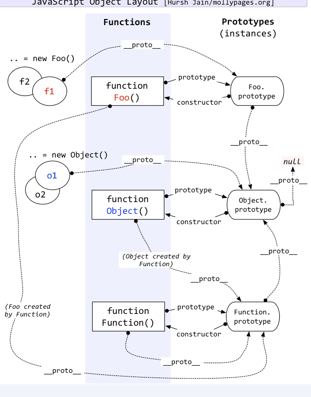

###### ARRON 2019 年 2 月 12 日   861字


在 对象 章节说过，对象一般有以下几个特点：
- 唯一标识性
- 有状态
- 有行为

基于类的的对象和基于原型的对象，都是顺应人类自然思维的产物。

“基于类”的编程提倡使用一个关注分类和类之间关系开发模型。在这类语言中，总是先有类，再从类去实例化一个对象。类与类之间又可能会形成继承、组合等关系。类又往往与语言的类型系统整合，形成一定编译时的能力。

与此相对，“基于原型”的编程看起来更为提倡程序员去关注一系列对象实例的行为，而后才去关心如何将这些对象，划分到最近的使用方式相似的原型对象，而不是将它们分成类。

### javascript的原型

不考虑复杂语法（如 new、Function Object、函数的 prototype 属性等），原型系统可以简单的用两条来概括：

- 所有对象都有私有字段 [[prototype]]，就是对象的原型；
- 读一个属性，如果对象本身没有，则会继续访问对象的原型，直到原型为空或者找到为止。

ES6之后，JS又提供了一系列操作原型的内置函数。

- Object.create 根据指定原型创建对象，原型可以为null
- Object.getPrototypeOf 获取一个对象的原型
- Object.setPrototypeOf 设置一个对象的原型

现在es6的class其实还是模拟基于类的面向对象，其实底层还是基于原型的。

下面的代码展示了用原型来抽象对象的例子。
```js
var cat = {
    say(){
        console.log("meow~");
    },
    jump(){
        console.log("jump");
    }
}

var tiger = Object.create(cat,  {
    say:{
        writable:true,
        configurable:true,
        enumerable:true,
        value:function(){
            console.log("roar!");
        }
    }
})


var anotherCat = Object.create(cat);

anotherCat.say();

var anotherTiger = Object.create(tiger);

anotherTiger.say();
```
### 早期版本中的类与原型

在早期JS版本中，“类”的定义是一个私有属性 [[class]]。内置类型可以使用Object.prototype.toString来访问[[class]]属性。

```js
var o = new Object;
var n = new Number;
var s = new String;
var b = new Boolean;
var d = new Date;
var arg = function(){ return arguments }();
var r = new RegExp;
var f = new Function;
var arr = new Array;
var e = new Error;
console.log([o, n, s, b, d, arg, r, f, arr, e].map(v => Object.prototype.toString.call(v))); 
```

在ES5之后，一些对象的[[class]]属性可以用Symbol.toStringTag来自定义。
```js
var o = { [Symbol.toStringTag]: "MyObject" }
console.log(o + "");  
// 加法字符串,对象拆箱会先调用Object.prototype.toString
// 结果返回 [object MyObject]
console.dir(o)   // Symbol(Symbol.toStringTag): "MyObject"

class ValidatorClass {
  get [Symbol.toStringTag]() {
    return "Validator";
  }
}
// 也可以这样自定义类型标签
```

Symbol.toStringTag 只能更改自已创建的类，如果自己的类没有定义Symbol.toStringTag，toString会返回[object Object]
```js
class ValidatorClass {}

Object.prototype.toString.call(new ValidatorClass()); // "[object Object]"
```
大多数内置对象即使没有toStringTag 属性，也能被 toString() 方法识别并返回特定的类型标签
```js
Object.prototype.toString.call('foo');     // "[object String]"
Object.prototype.toString.call([1, 2]);    // "[object Array]"
Object.prototype.toString.call(3);         // "[object Number]"
Object.prototype.toString.call(true);      // "[object Boolean]"
Object.prototype.toString.call(undefined); // "[object Undefined]"
Object.prototype.toString.call(null);      // "[object Null]"
```
另外一些对象类型则不然，toString() 方法能识别它们是因为引擎为它们设置好了 toStringTag 标签：
```js
Object.prototype.toString.call(new Map());       // "[object Map]"
Object.prototype.toString.call(function* () {}); // "[object GeneratorFunction]"
Object.prototype.toString.call(Promise.resolve()); // "[object Promise]"
```

### new
创建一个用户自定义的对象需要两步：

1. 通过编写函数来定义对象类型。
2. 通过new来创建对象实例。


当代码 new Foo(...) 执行时，会发生以下事情：

1. 一个继承自 Foo.prototype 的新对象被创建。
2. 使用指定的参数调用构造函数 Foo ，并将 this 绑定到新创建的对象。new Foo 等同于 new Foo()，也就是没有指定参数列表，Foo 不带任何参数调用的情况。
3. 如果构造函数返回了一个“对象”，那么这个对象会取代整个new出来的结果。如果构造函数没有返回对象，那么new出来的结果为步骤1创建的对象，ps：一般情况下构造函数不返回任何值，不过用户如果想覆盖这个返回值，可以自己选择返回一个普通对象来覆盖。当然，返回数组也会覆盖，因为数组也是对象。
<!-- 3. 由构造函数返回的对象就是 new 表达式的结果。如果构造函数没有显式返回一个对象，则使用步骤1创建的对象。（一般情况下，构造函数不返回值，但是用户可以选择主动返回对象，来覆盖正常的对象创建步骤） -->
<!-- MDN文档里的这句不太容易理解,换一句 -->

```js
var fun = function(){
this.name = 'peter';
	return {
		name: 'jack'
	};
}
var p = new fun();  
console.log(p.name)  // jack
// construct 返回对象.所以p的值是返回的对象

var fun = function(){
	this.name = 'peter';
	return 'jack';
}
var p = new fun();  
console.log(p.name)  // peter
// construct 返回的不是对象.所以p的值是Object.create(fun)的对象,也就是new出来本身的对象
```

所谓的"私有"也就是这样创建出来的

```js
function cls(){
    this.a = 100;
    return {
        getValue:() => this.a
    }
}
var o = new cls;
o.getValue(); //100
//a 在外面永远无法访问到,因为返回的是一个对象.所以构造函数new的对象会被覆盖,只能通过返回的getValue获取
```
> someObject.[[Prototype]] 符号是用于指向 someObject的原型。从 ECMAScript 6 开始，[[Prototype]] 可以通过Object.getPrototypeOf()和Object.setPrototypeOf()访问器来访问。这个等同于 JavaScript 的非标准但许多浏览器实现的属性 '\_\_proto\_\_'。也就是私有属性[[ Prototype ]]会指向prototype，但不是prototype。

new运算符其实是想让函数对象在语法上跟类变得相似，也就是模拟基于类的面向对象。

<!-- 所以第一步是以构造器的 prototype 属性为原型，创建新对象。而不是创建一个新的空对象new Object()，再链接到原型。因为new本来就是基本原型做的模拟类的行为，实现的过程不可能再去绕一圈再来一个new Object() -->

下面代码展示了用构造器模拟类的两种方法
```js
function c1(){
    this.p1 = 1;
    this.p2 = function(){
        console.log(this.p1);
    }
} 
var o1 = new c1;
o1.p2();


function c2(){
}
c2.prototype.p1 = 1;
c2.prototype.p2 = function(){
    console.log(this.p1);
}

var o2 = new c2;
o2.p2();
```
### 原型链

其实每个 JS 对象都有 \_\_proto\_\_ 属性，这个属性指向了原型。这个属性在现在来说已经不推荐直接去使用它了，这只是浏览器在早期为了让我们访问到内部属性 [[prototype]] 来实现的一个东西。

原型也是一个对象，并且这个对象中包含了很多函数，所以我们可以得出一个结论：对于 obj 来说，可以通过 \_\_proto\_\_ 找到一个原型对象，在该对象中定义了很多函数让我们来使用。

原型中还有一个 constructor 属性，也就是构造函数。原型的 constructor 属性指向构造函数，构造函数又通过 prototype 属性指回原型，但是并不是所有函数都具有这个属性，Function.prototype.bind() 就没有这个属性。



总结起来就是以下几点：
- Object 是所有对象的爸爸，所有对象都可以通过 \_\_proto\_\_ 找到它
- Function 是所有函数的爸爸，所有函数都可以通过 \_\_proto\_\_ 找到它
- 函数的 prototype 是一个对象
- 对象的 \_\_proto\_\_ 属性指向原型， \_\_proto\_\_ 将对象和原型连接起来组成了原型链

原型链的终点为null，因为规范中原型链必须是有限长度(从任一节点出发，经过有限步骤后必须到达一个终点。也不能有环。)


### ES6的类

ES6新增加了class关键字，function也可以回归本来的函数语义。我们也可以使用JS官方的基于类的标准写法，虽然类的实际运行也是基于原型。

```js
class Rectangle {
  constructor(height, width) {
    this.height = height;
    this.width = width;
  }
  // Getter
  get area() {
    return this.calcArea();
  }
  // Method
  calcArea() {
    return this.height * this.width;
  }
}
area是属性，实例可以直接获取。calcArea是方法，需要加()才能调用。在现有的类语法中，getter/setter 和 method 是兼容性最好的。我们通过 get/set 关键字来创建 getter。
```
class的继承
```js
class Animal { 
  constructor(name) {
    this.name = name;
  }
  
  speak() {
    console.log(this.name + ' makes a noise.');
  }
}

class Dog extends Animal {
  constructor(name) {
    super(name); // call the super class constructor and pass in the name parameter
  }

  speak() {
    console.log(this.name + ' barks.');
  }
}

let d = new Dog('Mitzie');
d.speak(); // Mitzie barks.
```

### 获取全部js固有对象
前9个是方法,后4个是命名空间,中间是构造器
```js
var set = new Set()
var objects = [
	eval,
	isFinite,
	isNaN,
	parseFloat,
	parseInt,
	decodeURI,
	decodeURIComponent,
	encodeURI,
	encodeURIComponent,
	Array,
	Date,
	RegExp,
	Promise,
	Proxy,
	Map,
	WeakMap,
	Set,
	WeakSet,
	Function,
	Boolean,
	String,
	Number,
	Symbol,
	Object,
	Error,
	EvalError,
	RangeError,
	ReferenceError,
	SyntaxError,
	TypeError,
	URIError,
	ArrayBuffer,
	SharedArrayBuffer,
	DataView,
	Float32Array,
	Float64Array,
	Int8Array,
	Int16Array,
	Int32Array,
	Uint8Array,
	Uint16Array,
	Uint32Array,
	Uint8ClampedArray,
	Atomics,
	JSON,
	Math,
	Reflect
]
objects.forEach(o => set.add(o))

for (var i = 0; i < objects.length; i++) {
	var o = objects[i]
	for (var p of Object.getOwnPropertyNames(o)) {
		var d = Object.getOwnPropertyDescriptor(o, p)
		if ((d.value !== null && typeof d.value === 'object') || typeof d.value === 'function')
			if (!set.has(d.value)) set.add(d.value), objects.push(d.value)
		if (d.get) if (!set.has(d.get)) set.add(d.get), objects.push(d.get)
		if (d.set) if (!set.has(d.set)) set.add(d.set), objects.push(d.set)
	}
}
console.log( objects);
```